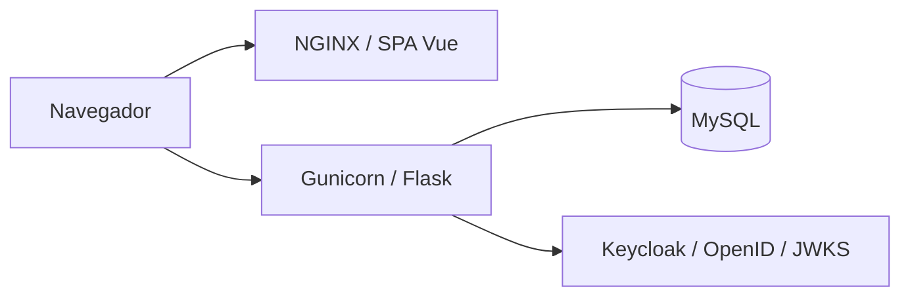

# Arquitetura e mapa de implementação

Este documento orienta agentes a delimitar implementações na aplicação existente. A referência histórica é o commit
`b459944`, último dos seis commits disponíveis quando este mapa foi escrito. As regras de trabalho estão em
[AGENTS.md](AGENTS.md); as decisões atômicas e cumulativas estão em [adrs/](adrs/), no formato `ADR-NNNN.md`.

## Visão geral

O repositório contém uma API Flask, uma SPA Vue 3 e a configuração Docker dos serviços auxiliares. O domínio é composto
por autores, seus artigos e perfis sociais. A UI consulta a API via HTTP; a API persiste dados no MySQL e delega
autenticação ao Keycloak.

A SPA é entregue pelo NGINX, mas suas chamadas à API saem do navegador. `ui/nginx.conf` não configura proxy da API. O
Compose expõe UI em 8080, API em 3000, MySQL em 3306 e Keycloak em 8081. Não existe uma pasta `db/`: o banco é definido
como serviço no Compose, com volume `mysql_data`.

## Mapa de pastas e arquivos principais

| Caminho | Função e limite de responsabilidade |
| --- | --- |
| `README.md` | Apresentação, stack e instruções de execução local e Docker. |
| `AGENTS.md` | Processo de desenvolvimento: branches, TDD, revisão, cobertura e modelos. |
| `ARCHITECTURE.md` | Mapa atual, fluxos, contexto histórico e orientação de escopo. |
| `CHANGELOG.md` | Mudanças para pessoas; distingue alterações pendentes de histórico reconstruído. |
| `adrs/` | Decisões numeradas e cumulativas, com evidências, contexto e consequências. |
| `Dockerfile` | Estágios `api-app`, `ui-build` e `ui-app`; Python 3.14.7, build Node 24 e runtime NGINX. |
| `docker-compose.yml` | Serviços `api`, `ui`, `db` e `keycloak`, portas, ambiente, dependências e volumes. |
| `LICENSE` | Licença MIT atual. |
| `.dockerignore` | Evita enviar dependências, planos locais e artefatos gerados ao contexto Docker. |
| `.gitignore` | Exclusões de dependências, ambientes, artefatos gerados e planos/specs locais em `docs/`. |
| `package.json` e `package-lock.json` (raiz) | Dependência markdownlint-cli2 e scripts `lint:md`/`lint:md:fix`. |
| `.markdownlint-cli2.jsonc` | Coleta de Markdown e convenções de lint para prosa, tabelas e changelog. |
| `.cursorrules` | Instruções legadas do Cursor; contém referências antigas e centralização documental incompatível com a solicitação atual. A solicitação explícita de documentos separados prevalece. |
| `data/coverage/pytest-report.xml` | Relatório JUnit histórico versionado; não comprova cobertura nem execução atual. |

### API: `api/`

| Caminho | Função e quando alterar |
| --- | --- |
| `app.py` | Factory `create_app()`, instância WSGI `app`, registro de extensões, CORS, Swagger, hooks HTTP, erros e bootstrap de banco. Alterar para comportamento transversal ou registro de integração. |
| `config.py` | Configuração por ambiente, banco, logs, Swagger e Keycloak. `TestConfig` usa SQLite em memória por padrão. |
| `extensions.py` | Instâncias compartilhadas de SQLAlchemy e Flask-Migrate. |
| `requirements.txt` e `requirements-dev.txt` | Dependências Python fixadas; o arquivo de desenvolvimento inclui pytest-cov e Ruff. |
| `pyproject.toml` | Configuração Ruff e cobertura de linhas de toda a produção Python, incluindo migrations. |
| `logging_config.py` e `logs/` | Configuração dos logs HTTP/SQLAlchemy e diretório de saída; `.gitkeep` preserva a pasta. |
| `blueprints/__init__.py` | Registro dos blueprints da aplicação. |
| `blueprints/articles.py` | CRUD de artigos e agregação `/articles/count_by_author`; consultas e transações estão no próprio blueprint. |
| `blueprints/authors.py` e `blueprints/socials.py` | CRUD de autores e perfis sociais. |
| `blueprints/auth.py` | `POST /login` e `GET /admin/profile`; interpretação de Bearer token e respostas HTTP de autenticação/autorização. |
| `blueprints/health.py`, `metrics.py` e `tech.py` | Healthcheck, exposição de métricas e relatório técnico. |
| `blueprints/utils.py` | Respostas JSON e erros compartilhados pelos endpoints. |
| `models/author.py`, `article.py` e `social.py` | Entidades, colunas, relacionamentos e restrições de persistência. Autores possuem artigos e perfis sociais. |
| `models/base.py` | Mixins de timestamps e serialização. |
| `models/seed_run.py` | Controle de execução dos seeds pelo nome. |
| `models/__init__.py` | Exportação e carregamento dos modelos para registro no ORM. |
| `schemas/author.py`, `article.py` e `social.py` | Validação e serialização Marshmallow dos contratos de entrada/saída. |
| `migrations/env.py`, `alembic.ini` e `script.py.mako` | Ambiente e estrutura das migrations Alembic/Flask-Migrate. |
| `migrations/versions/20251130_0001_initial_schema.py` | Migration inicial do domínio. Adicionar novas migrations para evolução de banco já existente; não reescrever o histórico aplicado. |
| `seeds/bootstrap.py` | Upsert de dados iniciais e registro `SeedRun`; pula o seed se seu nome já foi aplicado. |
| `seeds/data.py` e `article_seed_data.json` | Dados iniciais de autor, perfis e artigos. Alterar o arquivo não reaplica automaticamente um seed já registrado. |
| `seeds/__init__.py` | Exporta o bootstrap de seeds. |
| `services/keycloak_client.py` | Cliente HTTP de OpenID, troca de senha por tokens, cache de discovery/JWKS, validação JWT e papéis do realm. |
| `services/tech_report.py` | Montagem do relatório HTML de runtime, banco, ambiente e dependências. |
| `observability/metrics.py` e `observability/__init__.py` | Coleta e formatação das métricas; integração com OpenTelemetry e exposição Prometheus/OpenMetrics. |
| `swagger/v1/swagger.yaml` | Especificação estática dos contratos HTTP; atualizar junto de mudanças de API. |
| `pytest.ini` | Descoberta em `tests/`, importação da API e filtros de warnings. |
| `tests/conftest.py` | Fixtures Flask/SQLite e recriação das tabelas entre testes. Não exercita migrations no MySQL. |
| `tests/requests/` | Testes HTTP de artigos, autores, perfis, autenticação, saúde, métricas e relatório técnico. |
| `tests/factories/` e `tests/utils.py` | Construção de dados e utilidades de teste. |
| `tests/services/` e `tests/seeds/` | Testes do cliente Keycloak real com HTTP simulado e do bootstrap de dados no banco de testes. |
| `tests/test_migrations.py` | Exercita upgrade/downgrade da migration inicial em banco temporário. |

### UI: `ui/`

| Caminho | Função e quando alterar |
| --- | --- |
| `package.json` e `package-lock.json` | Dependências, scripts e resolução de versões; `test:unit` executa Vitest com cobertura. |
| `vite.config.js` e `jsconfig.json` | Build Vite, integração Vitest e resolução de imports. |
| `eslint.config.js` | Regras ESLint para JavaScript, Vue 3 e testes Vitest. |
| `.env.production` | Variáveis de build da UI; não constitui configuração dinâmica do NGINX. |
| `nginx.conf` | Arquivos estáticos, fallback de rotas da SPA e cache. |
| `index.html` | Entrada Vite com título, ícones e montagem da SPA. |
| `public/` | Ícones, manifesto e mídia copiados ao build. |
| `src/main.js` | Inicialização Vue, plugins e estilos. |
| `src/App.vue` | Componente raiz da SPA. |
| `src/router/index.js` | Rotas em modo history: `/`, `/articles/:slug?`, `/about` e `/admin`. |
| `src/components/SiteLayout.vue` | Layout, navegação e elementos compartilhados. |
| `src/components/HelloWorld.vue` | Componente de exemplo remanescente; verificar uso antes de ampliar seu escopo. |
| `src/views/HomeView.vue` e `ArticleView.vue` | Listagem/apresentação e leitura de artigos. |
| `src/views/AboutView.vue` | Apresentação do autor e informações relacionadas. |
| `src/views/SocialsView.vue` | Visualização de perfis sociais; não está registrada como rota no router atual. |
| `src/views/AdminLoginView.vue` | Login administrativo e apresentação do perfil autenticado. |
| `src/services/articlesService.js`, `authorsService.js` e `socialsService.js` | Acesso HTTP aos recursos e tratamento de respostas; preservar contratos consumidos pelas views. |
| `src/services/authService.js` | Login, perfil Bearer e persistência de sessão em `sessionStorage`; base por `VITE_API_BASE_URL`. |
| `src/assets/` | CSS global e recursos processados pelo bundler. |
| `vite.config.js` (test) | Ambiente jsdom, mocks e threshold de 85% exclusivamente de linhas. Inclui main/router na coleta de JavaScript/Vue. |
| `tests/setup/vitest.setup.js` | Preparação comum do ambiente de teste. |
| `tests/unit/views/`, `components/` e `services/` | Testes correspondentes às views, layout e clientes HTTP. |
| `tests/unit/factories/` e `mocks/` | Dados de teste, fetch simulado e substitutos de arquivos/estilos. |

### Identidade: `keycloak/`

`realm-python-demo.json` define o realm importado pelo container, o cliente da API, os papéis `admin` e `author` e
usuários de demonstração. Mudanças no modelo de autorização podem exigir alteração conjunta do realm, configuração da
API, cliente Keycloak e testes de autenticação.

## Fluxos e contratos a preservar

1. **Conteúdo:** view → serviço JavaScript → blueprint → schema/model → banco → JSON → view. Os endpoints de alteração
   usam envelopes `article`, `author` e `social`; conferir schema e teste HTTP antes de modificar payloads.
2. **Inicialização:** importar `app.py` cria a aplicação. Fora de `TESTING`, executa migrations e seeds. Mudanças nesse
   caminho afetam também o startup dos workers Gunicorn.
3. **Identidade:** `/admin` envia credenciais a `/login`; a API usa o grant de senha do Keycloak, valida o token e
   devolve tokens/papéis. A UI guarda a sessão e consulta `/admin/profile`, que exige o papel configurado. Os CRUDs não
   recebem proteção automaticamente por existir esse fluxo.
4. **Observabilidade:** hooks da aplicação registram requisições e logs; blueprints expõem `/metrics`, `/liveness` e
   `/tech`. Mudanças globais devem preservar registro de erros sem contagem duplicada.
5. **Contrato publicado:** Swagger é um arquivo estático servido em `/openapi.yaml`, com UI em `/api-docs`; não é
   gerado automaticamente pelos blueprints.

A UI atual consulta conteúdo e apresenta login/perfil, sem telas de edição do domínio. Os serviços de conteúdo mantêm
cache em memória; a seleção de artigo por slug ocorre no cliente após consultar o catálogo. Funcionalidades de edição
precisam incluir invalidação desse cache e uma definição explícita de autorização.

## Como fechar o escopo de uma implementação

| Solicitação | Arquivos normalmente envolvidos | Verificações necessárias |
| --- | --- | --- |
| Novo campo de domínio | Modelo, nova migration, schema, blueprint, Swagger; serviço/view se exposto na UI | Testes HTTP e da UI afetada; compatibilidade de dados e execução de migration |
| Regra de validação ou resposta HTTP | Schema e/ou blueprint correspondente; Swagger | Testes de sucesso, erro e limites; impacto no serviço consumidor |
| Nova página ou navegação | View, router, layout quando necessário, serviço HTTP | Testes de view/serviço; fallback NGINX se mudar roteamento |
| Login ou autorização | Blueprint auth, cliente Keycloak, config, realm, authService e view | Tokens inválidos, papéis ausentes e falhas externas; separar teste mockado de integração real |
| Dados iniciais | Seeds e, se necessário, estratégia de novo seed/migration | Banco novo e banco com seed já registrado |
| Métricas ou relatório técnico | Observabilidade, hooks, blueprint e serviço técnico | Testes de saúde/métricas/relatório e caminhos de erro |
| Deploy ou variável de ambiente | Compose, Dockerfile, config e/ou variáveis de build Vue | Build, startup e conectividade a partir do navegador e dos containers |

Antes de implementar, identificar o comportamento, consumidores do contrato, persistência afetada e testes
correspondentes. Declarar quais arquivos serão alterados e quais integrações exigem validação. Evitar reestruturar
módulos não envolvidos; seguir o TDD e os gates de cobertura de `AGENTS.md`.

## Contexto histórico

| Data do commit | Evidência | Evolução observável |
| --- | --- | --- |
| 2025-02-11 | `134c57e` | Fundação com README, ignore e licença GNU AGPL; ainda sem aplicação. |
| 2025-11-30 | `291a07f` | Introdução conjunta de API Flask, domínio, migrations, seeds, observabilidade, SPA Vue, testes e Docker; troca da licença para MIT. |
| 2025-11-30 | `c4f0f3d` | Inclusão de CORS global na API e revisão de dependências. |
| 2025-11-30 | `ec76ee3`, `329763c` | Refinamento do README e correção da descrição de origem do projeto. |
| 2025-12-19 | `b459944` | Keycloak, endpoints de autenticação, sessão administrativa da UI e testes correspondentes. |

Não há tags no histórico consultado. A versão `0.1.0` no pacote da UI não comprova um release do projeto. Nomes
residuais como `ruby_demo_development` não demonstram migração de Ruby: o histórico disponível não contém essa
implementação. As razões não registradas dos autores não são tratadas como fatos nos ADRs.

Na atualização em desenvolvimento, a migração para Vue 3, Vite e Vitest está registrada nos
[ADR-0031](adrs/ADR-0031.md), [ADR-0032](adrs/ADR-0032.md) e [ADR-0033](adrs/ADR-0033.md).
O [ADR-0034](adrs/ADR-0034.md) registra a remoção de BootstrapVue com preservação do Bootstrap 4;
os [ADR-0035](adrs/ADR-0035.md) e [ADR-0036](adrs/ADR-0036.md) registram Ruff e markdownlint-cli2.
Planos e especificações ficam locais conforme o [ADR-0037](adrs/ADR-0037.md). Essas alterações ainda não
correspondem a um release nem a um commit publicado.

## Limites atuais relevantes para agentes

- Testes API usam SQLite e testes UI usam mocks; resultados verdes não comprovam integração MySQL/Keycloak nem o Compose
  completo.
- O startup com quatro workers aplica bootstrap em paralelo e pode falhar ao criar tabelas em banco vazio. A
  coordenação desse bootstrap ainda depende de alinhamento arquitetural.
- As contas anteriores `admin` e `vinicius` no realm não têm nome e sobrenome exigidos pelo perfil do Keycloak 26.4.7;
  o login pode retornar `Account is not fully set up`. O usuário de testes `john.doe` tem perfil completo.
  Testes unitários não detectam essa restrição do servidor real.
- API e UI coletam cobertura com gate de 85% exclusivamente de linhas; consultar os relatórios da execução atual,
  sem usar esta documentação como comprovação de resultado.
- URLs Vue são resolvidas no build; conferir as variáveis de cada serviço antes de assumir que uma única variável
  reconfigura toda a UI.
- `ArticleView.vue` e `AboutView.vue` renderizam conteúdo do banco com `v-html`. Alterações que permitam editar esse
  conteúdo devem incluir no escopo o tratamento de HTML e as permissões de escrita.
- O Keycloak roda em `start-dev`; o Compose não define dependência/healthcheck dele para a API e não configura banco
  externo para o Keycloak. Sua dependência `db` não equivale a persistência no MySQL.
- O cliente JWT desativa validação de audience (`verify_aud=False`). Alterações de autenticação precisam considerar esse
  comportamento existente; este documento não altera a política.
- Há credenciais de demonstração na configuração. O mapa descreve o ambiente existente e não constitui arquitetura de
  produção validada.

Atualizar este mapa quando houver mudanças de estrutura ou fluxo e registrar novas decisões em ADRs, preservando os
registros anteriores.
