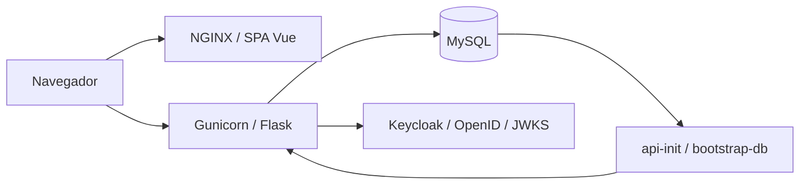
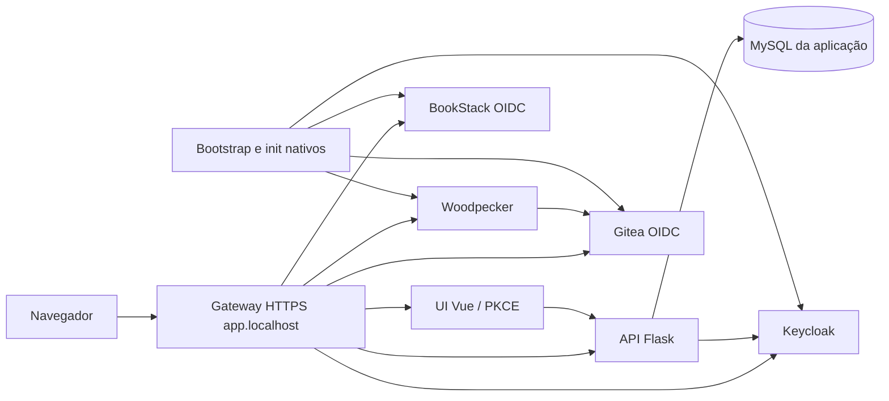

# Arquitetura e mapa de implementação

Este documento orienta agentes a delimitar implementações na aplicação existente. A referência histórica é o commit
`b459944`, último dos seis commits disponíveis quando este mapa foi escrito. As regras de trabalho estão em
[AGENTS.md](AGENTS.md); as decisões atômicas e cumulativas estão em [adrs/](adrs/), no formato `ADR-NNNN.md`.

## Visão geral

O repositório contém uma API Flask, uma SPA Vue 3 e a configuração Docker dos serviços auxiliares. O domínio é composto
por autores, seus artigos e perfis sociais. A UI consulta a API via HTTP; a API persiste dados no MySQL e delega
autenticação ao Keycloak.

A SPA é entregue pelo NGINX; na stack portátil histórica, suas chamadas à API saem do navegador. O arquivo
`docker-compose.yml` preserva as portas de desenvolvimento 8080, 3000, 3306 e 8081 e seu volume `mysql_data`. O Compose
local padrão descrito abaixo publica apenas o gateway TLS em loopback.

## Compose local padrão e SSO

`compose.yaml` é o Compose selecionado por `docker compose up` na raiz. Ele mantém configuração local em
`infra/.local/` e segredos/chaves gerados em `infra/secrets/local/`; esses diretórios são ignorados pelo Git e não são
requisitos externos ao checkout. `local-init` prepara uma geração antes dos serviços dependentes. `keycloak-init`,
`app-init` e os inicializadores de BookStack, Gitea e Woodpecker terminam antes que o gateway anuncie suas rotas. Os
marcadores `ready/{bookstack,gitea,ci}` devem corresponder a `bootstrap-generation`; uma falha remove readiness para a
geração ativa e mantém as rotas fechadas. A composição raiz com bootstrap local está registrada no
[ADR-0074](adrs/ADR-0074.md), e a identidade administrativa centralizada no Keycloak no [ADR-0075](adrs/ADR-0075.md).

As redes `app_data`, `legacy_data` e `ci_control` são internas ao projeto. O gateway liga as redes web para rotear
tráfego, e os bancos não publicam portas. A UI usa Authorization Code/PKCE e mantém access/refresh tokens em memória.
BookStack e Gitea usam seus provedores nativos; Woodpecker usa o login do Gitea. A identidade humana local é
`admin` / `admin!123`; permissões administrativas dependem dos grupos/claims provisionados, não apenas de nome ou email.
O logout da UI encerra sua sessão Keycloak, enquanto BookStack, Gitea e Woodpecker mantêm cookies próprios. O adapter
`keycloak-js` com PKCE está registrado no [ADR-0076](adrs/ADR-0076.md), e a forge Gitea do Woodpecker no
[ADR-0077](adrs/ADR-0077.md).

O gateway verifica a CA local e roteia somente depois do bootstrap. Seus logs de acesso incluem método, URI sem query e
status, nunca valores de query como `code`, `state` ou tokens. Os testes de navegador primeiro validam a cadeia TLS e o
SNI `app.localhost` via Node com a CA do projeto, extraem a SPKI do certificado conectado e passam ao Chromium somente
essa exceção específica. Eles usam perfil persistente descartável e caches sob `infra/.local/playwright/`; não mudam
trust store global nem aceitam certificados não relacionados.

## Mapa de pastas e arquivos principais

| Caminho | Função e limite de responsabilidade |
| --- | --- |
| `README.md` | Apresentação, stack e instruções de execução local e Docker. |
| `AGENTS.md` | Processo de desenvolvimento: branches, TDD, revisão, cobertura e modelos. |
| `ARCHITECTURE.md` | Mapa atual, fluxos, contexto histórico e orientação de escopo. |
| `ROADMAP.md` | Expectativas, dependências, critérios de conclusão e decisões pendentes das próximas fases. Não substitui a descrição da arquitetura atual. |
| `CHANGELOG.md` | Mudanças para pessoas; distingue alterações pendentes de histórico reconstruído. |
| `adrs/` | Decisões numeradas e cumulativas, com evidências, contexto e consequências. |
| `Dockerfile` | Estágios `api-app`, `ui-build` e `ui-app`; Python 3.14.7, build Node 24 e runtime NGINX. O estágio da API inclui o helper de runtime `ci/stack_config.py`. |
| `docker-compose.yml` | Serviços de desenvolvimento `api`, `api-init`, `ui`, `db` e `keycloak`; collector OTLP opcional no perfil `telemetry`. |
| `compose.yaml` | Ambiente local padrão com bootstrap automático, Keycloak, BookStack e Gitea nativos, Woodpecker ligado ao Gitea e gateway TLS por geração; não altera os Compose portáteis nem a configuração GitHub existente. |
| `infra/compose/app.yaml` | Stack portátil da aplicação, com MySQL persistente, API/init/UI e Keycloak; redes de dados interna e web compartilhável, sem portas de host. |
| `infra/compose/legacy.yaml` | Fixture isolada para BookStack/MariaDB, Gitea e share fechado; volumes próprios, nenhum dado de origem presumido e nenhuma porta publicada. |
| `infra/compose/ci.yaml` | Overlay portátil do Woodpecker; alias do servidor na rede web do gateway, exporter construído na imagem e runner não iniciado. |
| `infra/scripts/up-local.sh` | Preflight único de configuração, segredos, TLS e renderização das stacks antes de iniciar aplicação, legados, gateway e CI. |
| `infra/images.json` | Tags, digests, plataformas e fontes das imagens usadas pela stack portátil. |
| `infra/README.md` | Configuração local, arquivos externos de segredo, comandos da stack e limites da prova. |
| `LICENSE` | Licença MIT atual. |
| `.dockerignore` | Evita enviar dependências, planos locais e artefatos gerados ao contexto Docker. |
| `.gitignore` | Exclusões de dependências, ambientes, artefatos gerados e planos/specs locais em `docs/`. |
| `package.json` e `package-lock.json` (raiz) | Dependência markdownlint-cli2 e scripts `lint:md`/`lint:md:fix`. |
| `.markdownlint-cli2.jsonc` | Coleta de Markdown e convenções de lint para prosa, tabelas e changelog. |
| `.cursorrules` | Instruções legadas do Cursor; contém referências antigas e centralização documental incompatível com a solicitação atual. A solicitação explícita de documentos separados prevalece. |
| `data/coverage/pytest-report.xml` | Relatório JUnit histórico versionado; não comprova cobertura nem execução atual. |
| `ci/` | Bootstrap verificado de ferramentas, sete gates estáticos/de testes/build, avaliação separada da cobertura de linhas API/UI/CI, estado por gate, consolidação JSON, retenção local de relatórios, runner local e contratos/runtime da stack portátil. `setup-firewall.sh`/`firewall_setup.py` preparam um arquivo nftables privado após inventário de bridges e validação de sintaxe em namespace, sem aplicar regras. |

### API: `api/`

| Caminho | Função e quando alterar |
| --- | --- |
| `app.py` | Factory `create_app()` sem efeitos de banco, instância WSGI `app`, registro de extensões, CORS, Swagger, hooks HTTP e erros. Alterar para comportamento transversal ou registro de integração. |
| `bootstrap.py` | Comando Flask `bootstrap-db`, que aplica migrations e seeds explicitamente antes de servir requisições. |
| `config.py` | Configuração por ambiente, banco, logs, Swagger, Keycloak e exportação OTLP opcional. `TestConfig` usa SQLite em memória por padrão. |
| `extensions.py` | Instâncias compartilhadas de SQLAlchemy e Flask-Migrate. |
| `requirements.txt` e `requirements-dev.txt` | Exports gerados com hashes a partir de `pyproject.toml` e `uv.lock`; não editar como listas independentes. |
| `pyproject.toml` e `uv.lock` | Fonte de verdade das dependências Python com Python 3.14.7, `package = false`, grupo dev e configuração Ruff/cobertura de produção incluindo migrations. |
| `logging_config.py` e `logs/` | Configuração dos logs HTTP/SQLAlchemy e diretório de saída; `.gitkeep` preserva a pasta. |
| `blueprints/__init__.py` | Registro dos blueprints da aplicação. |
| `blueprints/articles.py` | CRUD de artigos e agregação `/articles/count_by_author`; consultas e transações estão no próprio blueprint. |
| `blueprints/authors.py` e `blueprints/socials.py` | CRUD de autores e perfis sociais. |
| `blueprints/auth.py` | `POST /login` e `GET /admin/profile`; interpretação de Bearer token e respostas HTTP de autenticação/autorização. |
| `blueprints/author_identities.py` | Vínculo privado `PUT/DELETE /authors/{id}/identity`, restrito a admin. |
| `blueprints/health.py`, `metrics.py` e `tech.py` | Liveness `/up` e `/liveness`, readiness limitada `/ready`, métricas Prometheus protegidas por admin e relatório técnico. |
| `blueprints/utils.py` | Respostas JSON e erros compartilhados pelos endpoints. |
| `models/author.py`, `article.py` e `social.py` | Entidades, colunas, relacionamentos e restrições de persistência. Autores e artigos têm flags de bypass HTML; autores possuem artigos e perfis sociais. |
| `models/author_identity.py` | Tabela privada que associa um autor ao par issuer/subject, com comparação binária e sem serialização pública. |
| `models/base.py` | Mixins de timestamps e serialização. |
| `models/seed_run.py` | Controle de execução dos seeds pelo nome. |
| `models/__init__.py` | Exportação e carregamento dos modelos para registro no ORM. |
| `schemas/author.py`, `article.py` e `social.py` | Validação e serialização Marshmallow dos contratos de entrada/saída. |
| `migrations/env.py`, `alembic.ini` e `script.py.mako` | Ambiente e estrutura das migrations Alembic/Flask-Migrate. |
| `migrations/versions/20261004_0002_author_identities.py` | Adiciona a associação privada binária issuer/subject, mantendo a migration inicial imutável. |
| `migrations/versions/20261004_0003_html_sanitization_flags.py` | Adiciona flags de bypass HTML a autores e artigos sem reescrever conteúdo preexistente. |
| `migrations/versions/20251130_0001_initial_schema.py` | Migration inicial do domínio. Adicionar novas migrations para evolução de banco já existente; não reescrever o histórico aplicado. |
| `seeds/bootstrap.py` | Upsert de dados iniciais e registro `SeedRun`; pula o seed se seu nome já foi aplicado. |
| `seeds/data.py` e `article_seed_data.json` | Dados iniciais de autor, perfis e artigos. Alterar o arquivo não reaplica automaticamente um seed já registrado. |
| `seeds/__init__.py` | Exporta o bootstrap de seeds. |
| `services/keycloak_client.py` | Cliente HTTP de OpenID, troca de senha por tokens, cache de discovery/JWKS, validação JWT e papéis do realm. |
| `services/authorization.py` | Leitura de Bearer claims, verificação de papéis e resolução do autor associado para as regras de escrita. |
| `services/tech_report.py` | Montagem do relatório HTML de runtime, banco, ambiente e dependências. |
| `observability/metrics.py` e `observability/__init__.py` | Métricas HTTP Prometheus com agregação multiprocess e instrumentação OpenTelemetry independente; exportação OTLP opcional por worker. |
| `observability/otel-collector.yaml` | Receiver OTLP/HTTP interno, limite de memória, processor de batch e exporter de debug para validação local. |
| `swagger/v1/swagger.yaml` | Especificação estática dos contratos HTTP; atualizar junto de mudanças de API. |
| `pytest.ini` | Descoberta em `tests/`, importação da API e filtros de warnings. |
| `tests/conftest.py` | Fixtures Flask/SQLite e recriação das tabelas entre testes. Não exercita migrations no MySQL. |
| `tests/requests/` | Testes HTTP de artigos, autores, perfis, autenticação, saúde, métricas e relatório técnico. |
| `tests/factories/` e `tests/utils.py` | Construção de dados e utilidades de teste. |
| `tests/services/` e `tests/seeds/` | Testes do cliente Keycloak real com HTTP simulado e do bootstrap de dados no banco de testes. |
| `tests/test_bootstrap_command.py` | Testes do comando `bootstrap-db`, factory sem efeitos de banco e repetição segura. |
| `tests/integration/test_compose_bootstrap.py` | Integrações MySQL/Compose opt-in para init, workers, falhas e ciclo de vida. |
| `tests/integration/test_keycloak_authorization.py` | Prova opt-in isolada com Keycloak real para audience, papéis e autoria; usa projeto/volumes únicos. |
| `tests/test_migrations.py` | Exercita upgrade/downgrade da migration inicial em banco temporário. |
| `tests/test_config.py` | Verifica configuração de produção sem defaults demonstrativos. |

### UI: `ui/`

| Caminho | Função e quando alterar |
| --- | --- |
| `package.json` e `package-lock.json` | Dependências, scripts e resolução de versões; `npm ci` instala o lock e `test:unit` exporta cobertura JSON de linhas para o gate. |
| `vite.config.js` e `jsconfig.json` | Build Vite, integração Vitest e resolução de imports. |
| `eslint.config.js` | Regras ESLint para JavaScript, Vue 3 e testes Vitest. |
| `.env.production` | Variáveis de build da UI; não constitui configuração dinâmica do NGINX. |
| `nginx.conf` | Arquivos estáticos, fallback de rotas da SPA e cache. |
| `index.html` | Entrada Vite com título, ícones e montagem da SPA. |
| `public/` | Ícones, manifesto e mídia copiados ao build. |
| `src/main.js` | Inicialização Vue, plugins e estilos. |
| `src/App.vue` | Componente raiz da SPA. |
| `src/router/index.js` | Rotas em modo history: `/`, `/articles/:slug?`, `/about` e `/admin`. |
| `src/components/SiteLayout.vue` | Layout, navegação e elementos compartilhados. |
| `src/components/HelloWorld.vue` | Componente de exemplo remanescente; verificar uso antes de ampliar seu escopo. |
| `src/views/HomeView.vue` e `ArticleView.vue` | Listagem/apresentação e leitura de artigos. |
| `src/views/AboutView.vue` | Apresentação do autor e informações relacionadas. |
| `src/views/SocialsView.vue` | Visualização de perfis sociais; não está registrada como rota no router atual. |
| `src/views/AdminLoginView.vue` | Login administrativo e apresentação do perfil autenticado. |
| `src/services/articlesService.js`, `authorsService.js` e `socialsService.js` | Acesso HTTP aos recursos e tratamento de respostas; preservar contratos consumidos pelas views. |
| `src/services/authService.js` | Login, perfil Bearer e persistência de sessão em `sessionStorage`; base por `VITE_API_BASE_URL`. |
| `src/assets/` | CSS global e recursos processados pelo bundler. |
| `vite.config.js` (test) | Ambiente jsdom, mocks e threshold de 85% exclusivamente de linhas. Inclui main/router na coleta de JavaScript/Vue. |
| `tests/setup/vitest.setup.js` | Preparação comum do ambiente de teste. |
| `tests/unit/views/`, `components/` e `services/` | Testes correspondentes às views, layout e clientes HTTP. |
| `tests/unit/factories/` e `mocks/` | Dados de teste, fetch simulado e substitutos de arquivos/estilos. |

### Identidade: `keycloak/`

`realm-python-demo.json` define o realm importado pelo container, o cliente da API, os papéis `admin` e `author`, o
mapper de audience `python-demo-api` e usuários de demonstração. Importação ocorre no bootstrap do realm; não atualiza
realm existente. A Fase 1B aceita JWT RS256 com issuer exato e audience configurada usando discovery/JWKS. Em produção,
`KEYCLOAK_BASE_URL` é o endereço de backchannel da API e `KEYCLOAK_ISSUER` é o issuer HTTPS anunciado, que precisa ser
alcançável conforme metadata/JWKS. O teste isolado provou hostname HTTPS público com backchannel dinâmico pela rede
interna, sem validar um deploy de produção.

Leituras permanecem públicas. Escritas em autores e perfis sociais e acesso a `/tech` exigem admin. Artigos permitem
admin ou author com vínculo prévio issuer/subject; o servidor atribui `author_id` ao criar artigo e limita alterações
ao próprio autor. Identificadores são armazenados em `author_identities` e omitidos do serializer público. O endpoint
de vínculo requer admin. Configuração de produção falha se DSN ou configurações explícitas de Keycloak faltarem ou
usarem credenciais demonstrativas. Consulte ADRs [0049](adrs/ADR-0049.md)–[0052](adrs/ADR-0052.md).

Artigos e biografias são sanitizados por allowlist na escrita e na serialização pública, incluindo registros legados
sem reescrita automática do banco. Admin pode optar explicitamente por armazenar e expor HTML bruto; esse conteúdo é
confiável e pode executar código no navegador. Para artigos, o controle da UI é restrito ao painel admin e usa checkbox
mais ação `Salvar`. A Fase 7 ainda cobre CRUD/editor editorial e permanece planejada. Consulte os
[ADRs-0053](adrs/ADR-0053.md) e [0054](adrs/ADR-0054.md).

### Stack Docker portátil da aplicação

`docker-compose.yml` continua sendo a configuração de desenvolvimento com credenciais demonstrativas e portas locais.
`infra/compose/app.yaml` prepara a API, o serviço `app-init`, a UI e Keycloak em imagens de build ou digests fixos, sem
montar o código-fonte nem publicar portas no host. A rede interna `app_data` contém o MySQL e os serviços que precisam
acessá-lo; a rede `app_web` expõe os aliases `app-api`, `app-ui` e `app-keycloak` ao gateway NGINX separado em
`infra/compose/gateway.yaml`. O gateway une somente redes web e cria a rede `ci_web` para o servidor Woodpecker.

A preparação compartilha uma instância MySQL 8.4 entre a API e o Keycloak, com usuários e schemas separados. O
provisionamento Keycloak cria ou atualiza apenas `keycloak.*`; credenciais são lidas de arquivos montados e os valores
de senha são enviados por parâmetros PyMySQL. O volume MySQL é persistente e exclusivo da stack. Consulte
[ADR-0069](adrs/ADR-0069.md).

O Keycloak usa `start`, banco MySQL, caminho interno `/auth`, hostname HTTPS explícito e cabeçalhos de proxy. A API usa
`http://app-keycloak:8080/auth` para iniciar a descoberta e valida o issuer externo
`https://${PUBLIC_HOST}/auth/realms/python-demo`. Metadados, tokens e JWKS passam pelo gateway usando o bundle CA
configurado em `GATEWAY_TLS_CA_FILE`; a API não desativa a validação TLS. A UI compila as rotas `/api/*` para o mesmo
gateway. A configuração ainda é preparação local e não representa deploy ou migração.

O gateway envia `/api` ao serviço sem o prefixo e preserva `/auth` e `/ci`; remove `/bookstack` ao encaminhar ao
BookStack, cuja `APP_URL` mantém o prefixo nos links e redirects externos. `/git` também é removido antes do Gitea, cuja
`ROOT_URL` mantém esse prefixo. O resolvedor Docker reconsulta aliases a cada dez segundos para permitir que
Woodpecker esteja parado durante a inicialização do gateway. A rota `/share` responde 404 sempre. BookStack responde
404 até `BOOKSTACK_BOOTSTRAP_CONFIRMED=true`, definido somente após substituir e validar a senha inicial. A fixture
local usa certificado sintético e porta HTTPS em loopback; não comprova firewall, DNS, TLS externo ou instalação na VPS.
O container tem filesystem somente leitura e mantém apenas as capabilities de leitura da chave TLS, ownership de cache,
bind da porta e troca para workers sem privilégios.
Consulte [ADR-0073](adrs/ADR-0073.md).

### Fixture isolada dos serviços legados

`infra/compose/legacy.yaml` mantém BookStack/MariaDB, Gitea e o share em projetos, redes e volumes separados da stack
principal. BookStack usa `/config` persistente e uma chave Laravel explícita; MariaDB 11.4.13 atende o requisito mínimo
publicado de MariaDB 10.6 para uma fixture nova. A compatibilidade ou migração de uma origem MariaDB 10.5 não foi
comprovada. BookStack/LinuxServer cria `admin@admin.com` / `password` no bootstrap de banco vazio, então essa conta
precisa ser trocada antes de qualquer exposição por gateway.

Gitea usa a imagem oficial e `/data` como volume completo; SQLite é somente a configuração da fixture vazia e não é uma
afirmação sobre a instalação de origem. A rede de dados é interna, nenhum serviço publica porta no host, e o share fica
montado read-only com NGINX configurado para negar todas as requisições. Consulte
[ADR-0070](adrs/ADR-0070.md), [ADR-0071](adrs/ADR-0071.md) e [ADR-0072](adrs/ADR-0072.md).

## Fluxos e contratos a preservar

1. **Conteúdo:** view → serviço JavaScript → blueprint → schema/model → banco → JSON → view. Os endpoints de alteração
   usam envelopes `article`, `author` e `social`; conferir schema e teste HTTP antes de modificar payloads.
2. **Inicialização:** importar `app.py` cria a aplicação sem efeitos de banco. O comando explícito
   `flask --app app bootstrap-db` aplica migrations e seeds. No Compose, executar manualmente pelo serviço
   `api-init` (`docker compose run --rm api-init flask bootstrap-db`), que não recebe o diretório multiprocess reservado
   à API; o serviço também espera o banco saudável e a API aguarda o sucesso do init antes de iniciar quatro workers.
   Falha do init bloqueia a API nova.
3. **Identidade:** na stack local padrão, a UI usa Authorization Code/PKCE com Keycloak e consulta `/admin/profile`
   usando seu access token em memória. BookStack e Gitea iniciam o OIDC por suas rotas nativas; Woodpecker autentica
   por Gitea. O fluxo legado `/login` continua disponível à stack portátil e a clientes existentes: a API valida issuer,
   audience e role no Bearer token. Nos endpoints de escrita, Bearer e papel são aplicados conforme o recurso; CRUD de
   artigo também exige vínculo privado para autor. Leia o ADR-0049 para a política e ADR-0051 para confiança
   issuer/audience.
4. **Saúde e observabilidade:** `/up` e `/liveness` são liveness público sem probes externos; `/ready` verifica MySQL e
   discovery Keycloak com timeout global de três segundos e capacidade limitada de probes. `/metrics` exige admin e
   agrega contadores/histogramas Prometheus dos workers com rótulos de rota estáveis. OpenTelemetry permanece uma
   instrumentação separada. Exportação OTLP é desativada por padrão e habilitada com `OTEL_METRICS_ENABLED=true` junto
   do perfil Compose `telemetry`; o collector não publica portas e não é dependência de serving. A integração local
   confirmou recebimento por workers distintos e continuidade de serving durante indisponibilidade do collector; essa
   prova não atesta operação ou capacidade na VPS. Mudanças globais devem preservar registro de erros sem contagem
   duplicada. Consulte os [ADRs-0055](adrs/ADR-0055.md)–[0057](adrs/ADR-0057.md).
5. **Contrato publicado:** Swagger é um arquivo estático servido em `/openapi.yaml`, com UI em `/api-docs`; não é
   gerado automaticamente pelos blueprints.

A UI atual consulta conteúdo e apresenta login/perfil, sem telas de edição do domínio. Os serviços de conteúdo mantêm
cache em memória; a seleção de artigo por slug ocorre no cliente após consultar o catálogo. Funcionalidades de edição
precisam incluir invalidação desse cache e uma definição explícita de autorização.

## Como fechar o escopo de uma implementação

| Solicitação | Arquivos normalmente envolvidos | Verificações necessárias |
| --- | --- | --- |
| Novo campo de domínio | Modelo, nova migration, schema, blueprint, Swagger; serviço/view se exposto na UI | Testes HTTP e da UI afetada; compatibilidade de dados e execução de migration |
| Regra de validação ou resposta HTTP | Schema e/ou blueprint correspondente; Swagger | Testes de sucesso, erro e limites; impacto no serviço consumidor |
| Nova página ou navegação | View, router, layout quando necessário, serviço HTTP | Testes de view/serviço; fallback NGINX se mudar roteamento |
| Login ou autorização | Blueprint auth, cliente Keycloak, config, realm, authService e view | Tokens inválidos, papéis ausentes e falhas externas; separar teste mockado de integração real |
| Dados iniciais | Seeds e, se necessário, estratégia de novo seed/migration | Banco novo e banco com seed já registrado |
| Métricas ou relatório técnico | Observabilidade, hooks, blueprint e serviço técnico | Testes de saúde/métricas/relatório e caminhos de erro |
| Deploy ou variável de ambiente | Compose, Dockerfile, config e/ou variáveis de build Vue | Build, startup e conectividade a partir do navegador e dos containers |

Antes de implementar, identificar o comportamento, consumidores do contrato, persistência afetada e testes
correspondentes. Declarar quais arquivos serão alterados e quais integrações exigem validação. Evitar reestruturar
módulos não envolvidos; seguir o TDD e os gates de cobertura de `AGENTS.md`.

## Contexto histórico

| Data do commit | Evidência | Evolução observável |
| --- | --- | --- |
| 2025-02-11 | `134c57e` | Fundação com README, ignore e licença GNU AGPL; ainda sem aplicação. |
| 2025-11-30 | `291a07f` | Introdução conjunta de API Flask, domínio, migrations, seeds, observabilidade, SPA Vue, testes e Docker; troca da licença para MIT. |
| 2025-11-30 | `c4f0f3d` | Inclusão de CORS global na API e revisão de dependências. |
| 2025-11-30 | `ec76ee3`, `329763c` | Refinamento do README e correção da descrição de origem do projeto. |
| 2025-12-19 | `b459944` | Keycloak, endpoints de autenticação, sessão administrativa da UI e testes correspondentes. |

Não há tags no histórico consultado. A versão `0.1.0` no pacote da UI não comprova um release do projeto. Nomes
residuais como `ruby_demo_development` não demonstram migração de Ruby: o histórico disponível não contém essa
implementação. As razões não registradas dos autores não são tratadas como fatos nos ADRs.

Na atualização em desenvolvimento, a migração para Vue 3, Vite e Vitest está registrada nos
[ADR-0031](adrs/ADR-0031.md), [ADR-0032](adrs/ADR-0032.md) e [ADR-0033](adrs/ADR-0033.md).
O [ADR-0034](adrs/ADR-0034.md) registra a remoção de BootstrapVue com preservação do Bootstrap 4;
os [ADR-0035](adrs/ADR-0035.md) e [ADR-0036](adrs/ADR-0036.md) registram Ruff e markdownlint-cli2.
Planos e especificações ficam locais conforme o [ADR-0037](adrs/ADR-0037.md). Essas alterações não correspondem
a um release identificado.

## Limites atuais relevantes para agentes

- Testes API usam SQLite e testes UI usam mocks; resultados verdes não comprovam integração MySQL/Keycloak nem o Compose
  completo.
- `api-init` coordena um projeto Compose por vez; exclusão entre projetos, hosts ou execuções manuais concorrentes não
  foi implementada. Serializar essas execuções. A atualização de schema deve parar a API, executar init e confirmar
  exit code 0 antes de iniciar os workers com a imagem nova.
- As contas anteriores `admin` e `vinicius` no realm não têm nome e sobrenome exigidos pelo perfil do Keycloak 26.4.7;
  o login pode retornar `Account is not fully set up`. O usuário de testes `john.doe` tem perfil completo.
  Testes unitários não detectam essa restrição do servidor real.
- API e UI coletam cobertura com gate de 85% exclusivamente de linhas; consultar os relatórios da execução atual,
  sem usar esta documentação como comprovação de resultado.
- URLs Vue são resolvidas no build; conferir as variáveis de cada serviço antes de assumir que uma única variável
  reconfigura toda a UI.
- `ArticleView.vue` e `AboutView.vue` renderizam conteúdo com `v-html`; sanitização e bypass administrativo estão
  descritos nos ADRs 0053–0054. Qualquer ampliação de conteúdo HTML deve reavaliar allowlist e autorização.
- Desenvolvimento mantém credenciais de demonstração; em `FLASK_ENV=production`, DSN MySQL e configuração explícita
  Keycloak são exigidos e defaults demonstrativos são rejeitados. Isso não prova deploy real.
- O `compose.yaml` raiz agora mantém a identidade humana local no Keycloak, configura BookStack e Gitea por seus
  mecanismos OIDC nativos e provisiona o OAuth do Woodpecker no Gitea. BookStack usa issuer/autorização públicos e
  backchannel TLS interno com certificado adicional e chave pública derivada de discovery/JWKS; rotação da chave
  assinadora do realm exige recriar os serviços de bootstrap para atualizar essa chave. O início dos redirects nativos
  foi verificado, sem comprovar login completo no navegador. O Compose operacional `docker-compose.yml` mantém sua
  configuração própria. A preparação em `infra/compose/app.yaml` usa
  Keycloak `start` e banco persistente separado da API por schema e usuário; o gateway preserva o issuer externo HTTPS.
- A validação JWT exige issuer e audience conforme o [ADR-0051](adrs/ADR-0051.md); não há exceção `verify_aud=False` na
  política atual.
- A configuração da raiz mantém credenciais de demonstração. A stack portátil exige configuração e segredos externos;
  ambas descrevem ambientes locais, sem constituir arquitetura de produção validada.

Atualizar este mapa quando houver mudanças de estrutura ou fluxo e registrar novas decisões em ADRs, preservando os
registros anteriores.

## Evolução planejada

O [ROADMAP](ROADMAP.md) organiza a evolução futura, separando escolhas alinhadas de propostas pendentes.
Os [ADRs 0038](adrs/ADR-0038.md) a [0045](adrs/ADR-0045.md) e os [ADRs 0058](adrs/ADR-0058.md) a
[0066](adrs/ADR-0066.md) registram decisões aceitas de planejamento. A definição Woodpecker inicializa versões
pinadas e instala Python por `uv.lock` e JavaScript por `npm ci`; os sete gates preservam logs e relatórios em diretório
próprio da identidade commit/execução. `run-gate.sh` grava estado atômico por gate, e o coletor valida os sete estados,
identidade e relatórios essenciais, marcando gates ausentes como `not_run`; falha, cancelamento, timeout e resultado
incompleto retornam erro. O runner local imprime o resumo e mantém XML/JSON no diretório de relatórios. A retenção local
remove execuções concluídas após 14 dias ou quando excedem o orçamento lógico de 1 GB, sem alcançar diretórios externos.
A etapa de resumo do workflow executa após sucesso ou falha; cancelamento abrupto pode deixar um gate em `running`, que
o coletor trata como falha. O encaminhamento de stdout dos jobs para journald/syslog e a limpeza independente dos
metadados do Woodpecker permanecem para a Tarefa 6. Isso valida comandos e fluxo local, sem declarar instalação do
Woodpecker, aprovação real de PR, capacidade da VPS ou encaminhamento operacional de logs como implantados. O editor
visual continua em discussão; outras propostas pendentes permanecem sujeitas ao desenho e alinhamento das fases
correspondentes. O
bootstrap por serviço init está implementado e registrado no [ADR-0048](adrs/ADR-0048.md), que substitui o registro
histórico [ADR-0010](adrs/ADR-0010.md).

## Proteções de integração

As regras GitHub aplicadas exigem PR para integrar à main, sem aprovação externa e sem bypass para push direto,
conforme [ADR-0046](adrs/ADR-0046.md). Force push e exclusão da main estão bloqueados.
Hoje somente o proprietário tem permissão de escrita; contribuições externas podem usar forks e PRs.

A criação de branches no repositório exige prefixos convencionais conforme [ADR-0047](adrs/ADR-0047.md).
A regra valida o prefixo, não todo o kebab-case nem branches em forks externos. AGENTS.md mantém a convenção completa.
Essas configurações ficam no GitHub; os ADRs documentam seu estado e não reaplicam regras em um clone.

### Plano de controle CI em preparação

A configuração local em [ci/README.md](ci/README.md) fixa Woodpecker 3.18.0, SQLite e agente com uma workflow.
A política audita settings reais, objeto trusted, contas antigas e crons; o proxy preserva `/ci` e bloqueia
manual/cron/restart nos endpoints da versão fixada. A auditoria é pontual, não um interlock contínuo.
A rede adicional de controle não isola as redes dinâmicas dos jobs. O serviço opt-in `exporter` encaminha linhas reais
das etapas via API autenticada para stdout; a unidade systemd de exemplo associa esse stdout a `LogNamespace=` e a
configuração de journald limita a namespace. O token fica em arquivo privado fora do checkout/jobs. Retenção chama a
API para remover apenas logs de pipelines terminais, mantendo metadados do pipeline; o cursor é privado e atômico, com
semântica de possível repetição na janela entre stdout e cursor. SQLite/WAL e cópia no journal ocupam espaço físico
separado; `VACUUM` e o custo físico continuam pendentes.

O agente agora requer o profile explícito `runner`, enquanto o exporter requer `logs`; executar `up` sem profile não
inicia o agente. Profiles são uma convenção Compose e não um interlock de execução ou prova de política live. A ativação
real ainda depende de auditoria de drift/API, autorização de instalação, prova de rede e medição de capacidade.
Na composição portátil, `infra/compose/ci.yaml` mantém o backend acessível pelo gateway como `ci-server`, sem porta
publicada no host, e substitui os mounts de código do exporter por uma imagem derivada. `infra/scripts/up-local.sh`
valida os modelos das stacks e os arquivos TLS antes de criar recursos, e bloqueia o profile `runner`. O collector OTLP
existente pode ser habilitado em `infra/compose/app.yaml` com `OTEL_METRICS_ENABLED=true` e profile `telemetry`; a
imagem/configuração permanecem as já registradas, sem endpoint publicado. Essa integração local não prova operação,
isolamento real ou capacidade na VPS.
O ADR-0067 acrescenta a preparação local de tabelas nftables próprias para INPUT, FORWARD e forwarding L2 entre portas
de containers em bridges Docker, com renderer/preflight fail-closed e rollback limitado às tabelas próprias. O inventário
confiável/CIDRs não foi preenchido para a VPS; integração com firewalld e Docker, DNS embutido, userland proxy,
persistência e prova comportamental continuam pendentes. Nenhuma regra ou configuração do host foi aplicada; a
preparação não comprova isolamento e não autoriza habilitar jobs.

O ADR-0068 registra a escolha do usuário por Ubuntu Server 26.04 LTS em uma VPS nova de 8 GB. A VPS Fedora 34 atual é
origem da migração, não destino; disponibilidade da imagem 26.04 pelo provedor e migração seguem pendentes. O script
administrativo [ci/setup-firewall.sh](ci/setup-firewall.sh) coleta bridges com `ip`, compara-as com o inventário
completo, verifica nftables usando `unshare` em namespace de usuário/rede e grava regras em arquivo privado por troca
atômica. Ele nunca aplica regras e não presume compatibilidade de uma versão específica do sistema.
